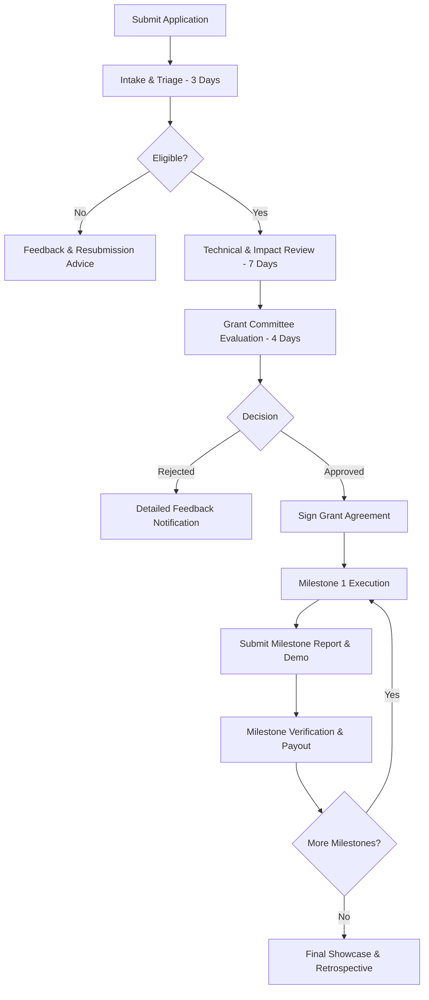

# Soroban Cookbook Community Grants Program

Welcome to the **Soroban Cookbook Community Grants Program**. This program provides financial, technical, and community support to developers, researchers, and creators building open-source examples, security tools, developer utilities, and educational materials for the Stellar and Soroban ecosystem.

---

## Table of Contents

- [Program Overview](#program-overview)
- [Grant Tiers & Funding](#grant-tiers--funding)
- [Target Focus Areas](#target-focus-areas)
- [Eligibility Criteria](#eligibility-criteria)
- [Application & Award Lifecycle](#application--award-lifecycle)
- [Program Documentation](#program-documentation)
- [Code of Conduct & Governance](#code-of-conduct--governance)

---

## Program Overview

The Soroban Cookbook is an open-source, community-driven resource designed to empower smart contract developers on Stellar. As the ecosystem expands, the Grants Program accelerates high-impact contributions by directly funding creators who fill critical recipe gaps, build real-world reference architectures, and pioneer robust security practices.

### Core Objectives

1. **Expand Cookbook Coverage:** Fund production-ready reference implementations in DeFi, NFTs, Governance, and Cross-Contract tooling.
2. **Elevate Smart Contract Security:** Support rigorous security analyses, formal verification guides, and threat modeling recipes.
3. **Enhance Developer Tooling:** Support open-source CLI utilities, scaffolding tools, testing frameworks, and simulator integrations.
4. **Foster Global Community Growth:** Incentivize high-quality tutorials, multilingual documentation, and ecosystem workshops.

---

## Grant Tiers & Funding

The program operates three distinct funding tiers tailored to project scope and expected development timeline:

| Tier | Grant Size (USD / XLM Equivalent) | Target Scope | Typical Duration | Review Cadence |
| :--- | :--- | :--- | :--- | :--- |
| **Tier 1: Micro-Grants** | Up to **$2,500** | Single cookbook recipe, bug bounty fixes, tutorial videos, translations | 2–4 weeks | Fast-track (5–7 days) |
| **Tier 2: Standard Grants** | **$2,500 – $10,000** | Full-stack dApp templates, complex protocol recipes (e.g. Lending, DEX Router, Account Abstraction), testing libraries | 1–3 months | Regular cycle (14 days) |
| **Tier 3: Strategic Grants** | **$10,000 – $25,000+** | Major tooling infrastructure, formal verification frameworks, multi-contract reference architectures | 3–6 months | Quarterly / Board approval |

---

## Target Focus Areas

We prioritize proposals addressing high-demand developer needs in the Soroban ecosystem:

- **DeFi Primitives:** Perpetual swaps, synthetic assets, yield aggregators, dynamic AMM curves, concentrated liquidity.
- **Security & Formal Verification:** Invariant testing suites, fuzzing harnesses, static analysis plugins, security checklist expansions.
- **Account Abstraction & Key Management:** Passkey authentication, session keys, multi-party computation (MPC) recovery.
- **Interoperability & Cross-Chain:** State bridges, oracle connectors, off-chain computation proofs.
- **Full-Stack Scaffolding & Tooling:** Production-ready web starter kits, testing mocks, indexing boilerplates.
- **Developer Education & Guides:** Deep-dive architectural breakdowns, video courses, enterprise case studies.

---

## Eligibility Criteria

All applicants and proposed projects must satisfy the following baseline requirements:

- **100% Open Source:** All deliverables must be licensed under standard open-source licenses (MIT, Apache 2.0, or dual MIT/Apache 2.0).
- **Public Repositories:** Code must be developed publicly on GitHub with clear documentation and tests.
- **Soroban SDK Alignment:** Contracts must target recent stable Soroban SDK releases and adhere to workspace coding standards.
- **Comprehensive Testing:** Smart contract code must achieve high test coverage (>90%) including unit, authorization, and error handling tests.
- **No Pre-existing Proprietary Restrictions:** Projects must not be encumbered by patents or restrictive proprietary agreements.

---

## Application & Award Lifecycle

1. **Submission:** Applicant submits the [Grant Application Form](./application-form.md) via GitHub Issue or pull request.
2. **Review & Evaluation:** Applications are evaluated following the [Review Process](./review-process.md) and scoring rubric.
3. **Decision & Notification:** Decisions follow the published [Decision Timeline](./decision-timeline.md).
4. **Milestone Tracking & Payouts:** Funds are disbursed in tranches upon verified milestone delivery following [Milestone Tracking](./milestone-tracking.md).
5. **Showcase & Celebration:** Completed projects are highlighted in the project [Showcase](../../SHOWCASE.md) and community channels.

---

## Program Documentation

Explore the detailed grant program guides:

- [📄 Grant Application Form Template](./application-form.md) — Standardized template for submitting new proposals.
- [🔍 Review Process & Scoring Rubric](./review-process.md) — Detailed criteria, reviewer guidelines, and scoring system.
- [⏱️ Decision Timeline & SLA](./decision-timeline.md) — Expected review milestones, committee meeting cadence, and disbursement timelines.
- [📈 Milestone Tracking & Verification](./milestone-tracking.md) — Progress reporting, verification requirements, and tranche release workflows.

---

## Code of Conduct & Governance

The Grants Program is administered in adherence to the Soroban Cookbook [Code of Conduct](../../CODE_OF_CONDUCT.md) and [Community Guidelines](../../COMMUNITY_GUIDELINES.md). Reviewers operate under a strict anti-conflict-of-interest policy. All deliberations, feedback, and grant disbursements are tracked publicly to ensure transparency and accountability.

For inquiries or pre-submission feedback, join the `#soroban` channel on [Stellar Discord](https://discord.gg/stellardev) or start a [GitHub Discussion](https://github.com/Soroban-Cookbook/Soroban-Cookbook-/discussions).
